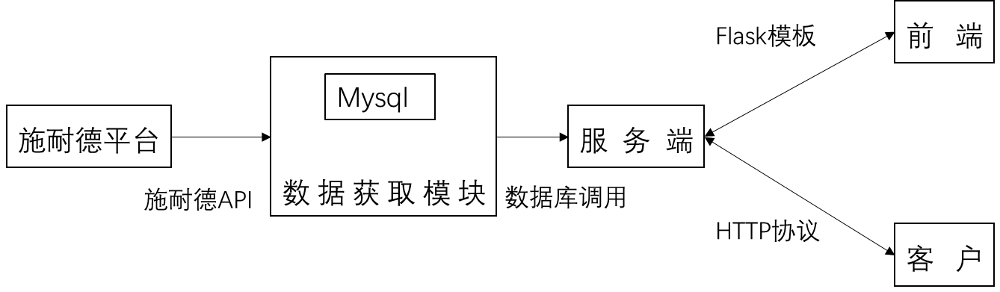

## 软件说明

秦骊服务器后台基于flask，前端基于HTML、JS，数据库使用mysql。

主要模块包括数据获取模块，服务端和前端页面。

实现的主要功能包括：
- 从施耐德平台获取数据并存入缓存数据库；
- 从缓存数据库中拉取数据实现服务器后端；
- 前端界面展示，并可对该过程进行可视化控制。

星星服务器的基本架构如图：

### 软件要求

#### 1.1数据获取模块

施耐德API接口参考《EMOP OpenAPI》,间隔5秒实时获取各数据点数据，并存入mysql数据库。

#### 1.2数据库设计

数据节点共有13个，设备共有两种类型，变量共有306个，详见《信息清单》。

数据结构，共2种类型，共13个字典，包括11个箱变，2个开关站，及其各自不同数量的变量。
数据库的最大存储时长为一天。

对部分变量，例如高压有功功率等，在存入数据库前完成数据格式转换，参考《信息清单》。

#### 1.3服务端设计

读取数据库，利用flask框架对外提供服务，具体接口格式参考《xx接口文档》：

技术要求：

token认证，参考https://github.com/miguelgrinberg/REST-auth 

数据刷新时间小于60秒

#### 1.4前端设计

需求界面如图

其中，站点信息配置包括：

- 站点返回名称修改
- 数据库刷新时间

#### 1.5代码混淆

对python和js代码进行代码混淆。

